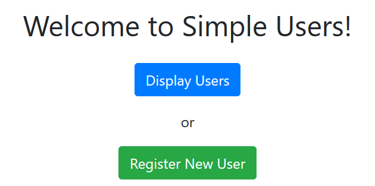
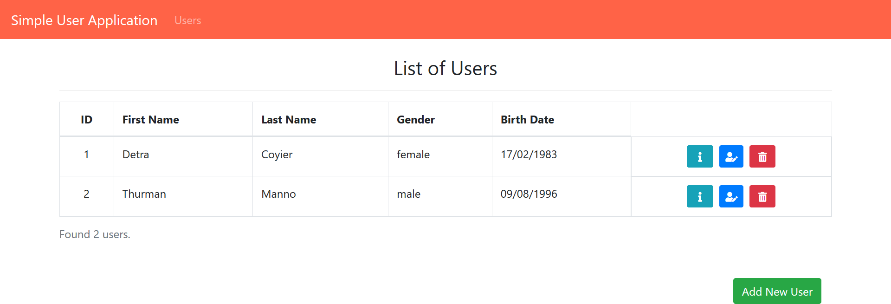
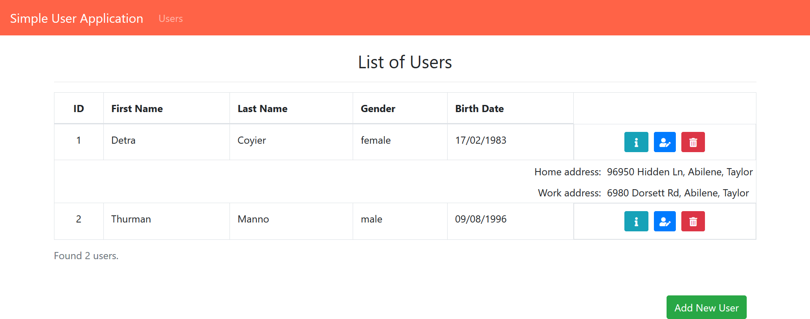
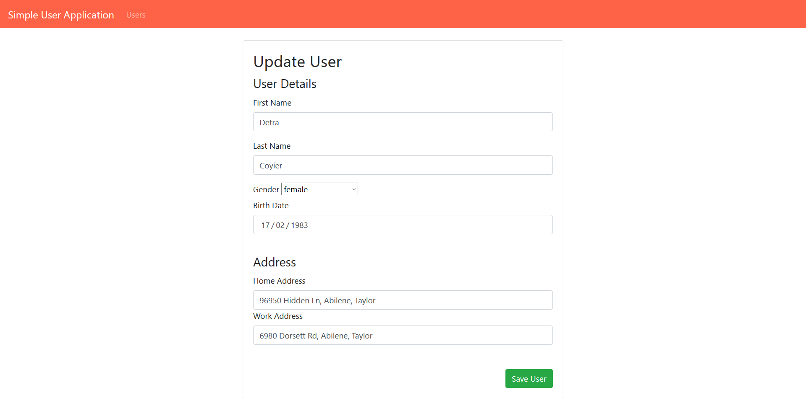

# simple_users application
Simple Maven CRUD application with one ManyToMany Model reference

User has a first name, a last name, a birthDate and a gender and a set of two addresses: one home address and one work address.

Technologies:
<ul>
  <li>Maven</li>
  <li>JPA - Hibernate</li>
  <li>Servlets and jsp</li>
  <li>MySQL</li>
  <li>js - AJAX - jQuery</li>
  <li>Javadoc</li>
  <li>Bootstrap</li>
  <li>CSS grid</li>
</ul>

Many thanks to <a href="https://www.youtube.com/channel/UC1Be9fnFTlcsUlejgfqag0g">javaguides</a>

<h2>Sample images</h2>
The data below are fake and were taken from <a href="https://www.briandunning.com/sample-data/">Free Sample Data</a>
<h3>Index</h3>

<h3>List Users</h3>

<h3>View User Addresses</h3>

<h3>Create or Edit User</h3>

